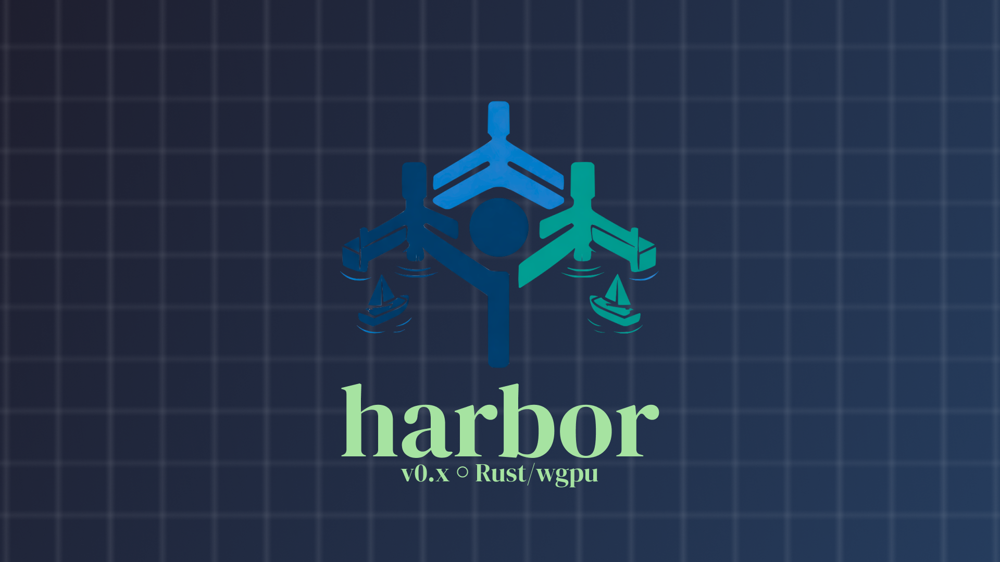

# Harbor Browser

⭐ Star us on GitHub — it motivates us a lot!

[Harbor](https://arson.dev/harbor) is a web browser built using Rust and Zig, made to teach me the ins and outs of browser development. It's not meant to be a competitor to mainstream browsers, but rather a personal project to explore the complexities of web technologies and browser architecture.

**Every last pixel is rendered by me, and every line of code is written from scratch.**

## Table of Contents

- [Components](#components)
  - [HTTP Client](#http-client) 

### Components
Harbor is comprised of 6 main components:

#### HTTP Client
The HTTP client is responsible for making network requests to fetch web resources. It handles the complexities of the HTTP protocol, including headers, and redirects. This component is the only one that uses external libraries (except for the renderer which uses wgpu and winit) - and that is for `TLS` support (enabling `https` support).

#### HTML Parser
The HTML parser takes the raw HTML content fetched by the HTTP client and parses it into a structured format, the DOM (Document Object Model). This allows the browser to understand the structure of the webpage and how elements relate to each other.

#### CSS Parser
The CSS parser processes the CSS stylesheets associated with the webpage. It parses the CSS rules and applies them to the corresponding HTML elements in the DOM, determining how each element should be styled. Currently only the following CSS properties are supported:
- `color`
- `background-color`
- `width`
- `position`
- `top`
- `left`
- `right`
- `bottom`
- `display`
- `font-size`
- `font-family`
- `font-weight`
- `font-style`

#### TTF Parser
The TTF (TrueType Font) parser is responsible for parsing font files to extract glyph information. This allows the browser to render text using the correct fonts specified in the CSS. This enables me to render text manually from glyphs, which is a fun challenge.

#### JavaScript Engine
The JavaScript engine executes JavaScript code embedded in web pages. WIP

#### Renderer
The renderer takes the structured data from the HTML and CSS parsers and renders it onto the screen. It uses the `wgpu` library for GPU-accelerated rendering and `winit` for window management. The renderer is responsible for drawing all visual elements of the webpage.
