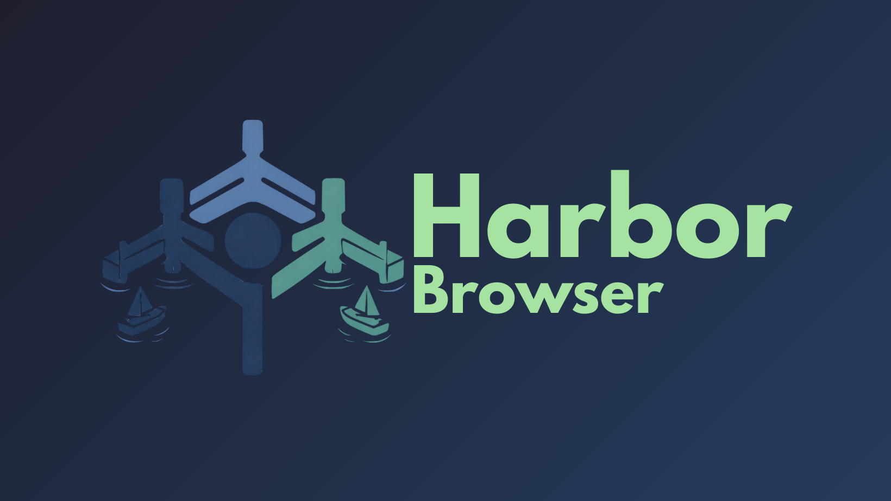

  

<h3 align="center">Harbor Browser</h3>

Harbor Browser aims to be a browser without the influence of the giants of Chromium or Firefox. Created to **provide refuge** to those seeking to escape the giants. **Open source** so anyone can contribute. **Free** in **freedom** and in **dollars**. Help make this browser great today!

 This is a work in progress and is not at a usable state yet. Do help this reach a usable state by contributing!
